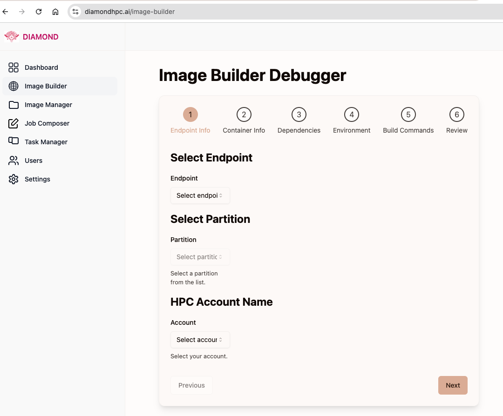

## Create a apptainer on the HPC system
Utilize the [Image Builder](https://diamondhpc.ai/image-builder) to create an apptainer image on the HPC system.
This functionality lets users create an apptainer definition file (`.def`) on the HPC system, build an apptainer image, and save it to the HPC system.

- On the left hand side menu tab, choose "Image Builder"
- Select the endpoint you want to use to build the image. Eg: `my-globus-compute-endpoint`
- Choose the account/allocation you want to use to build the image. Eg: `bcqj-delta-cpu`
- Choose the right partition for your job. Eg: `cpu`
- Choose a base image. Eg: `python:3.9`
- Copy-paste your requirements in the "Dependencies" section. Eg: `numpy==1.21` . This will get written to a `requirements.txt` file.
- Copy-paste your environment variables in the "Environment" section. Eg: `PYTHONPATH=/path/to/your/python/path`
- Type in your build command in the "Build Command" section. Eg: `pip install -r requirements.txt`
- Review all the settings and click on "Submit"
- Stdout and stderr will be streamed to the web page.

