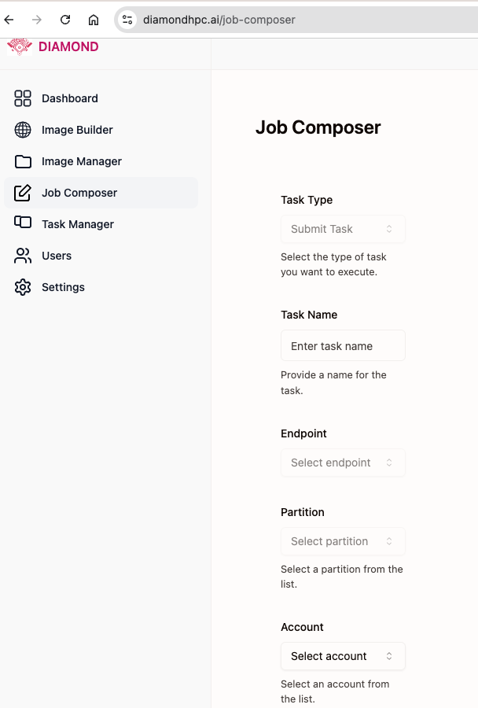

## Launch a job
Utilize the [Job Composer](https://diamondhpc.ai/job-composer) to launch a job on the HPC system.
- Enter the job name.
- Choose a globus compute endpoint to run the job on.
- Choose the HPC account/allocation to run the job on.
- Select a partition, number of nodes and other SLURM parameters for the job.
- Type in a log path to save the job's stdout and stderr.
- Type in a command to run your job.
- Hit "Submit" to launch the job.
- On the left hand side menu tab, choose "Jobs"
- Click on "Launch Job"
- Choose the image you want to use to launch the job.
- Copy-paste your job script in the "Job Script" section.
- Review all the settings and click on "Submit"
- Stdout and stderr will be streamed to the web page.

