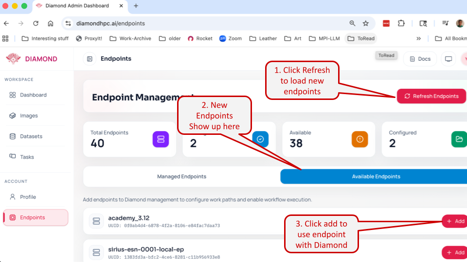

# NAIRR Tutorial Walkthrough

We will be using the [Delta Supercomputer](https://www.ncsa.illinois.edu/resources-and-services/compute-resources/delta/)
at [NCSA](https://www.ncsa.illinois.edu/) for the tutorial. To get started we recommend getting an account on this
machine via NSF's [ACCESS program](https://access-ci.org/).


## Note
>  If you responded to our email asking for your email to be setup with an NCSA allocation,
>  you are ready to use the Globus Compute Multi-User endpoint and can skip the steps outlined below.


## Manual Setup

Diamond uses [Globus Compute](https://www.globus.org/comp) to orchestrate Model training, Fine-tuning and serving
remotely on NSF resources. When the facility has not already setup a Multi-User Endpoint(MEP) managed by the admin
staff, or the MEP is unusable for you, you may install and run it yourself.

We outline the steps below:


1. Open a terminal and SSH into Delta system
```
ssh <username>@login.delta.ncsa.illinois.edu
```

2. We strongly recommend setting up a [Virtual environment](https://docs.python.org/3/library/venv.html) with
[uv](https://docs.astral.sh/uv/).

```
# Use uv to create a vitualenv with python3.11 interpreter

uv venv venv_py3.11 --python=3.11
source venv_py3.11/bin/activate
```

3. Install globus-compute-endpoint latest for ease of setup.

```
uv pip install globus-compute-endpoint
```

4. Start the Globus Compute Endpoint

```
# Initialize the endpoint
globus-compute-endpoint configure Diamond_Delta_MEP
globus-compute-endpoint start Diamond_Delta_MEP

# Leave the MEP running in this terminal session
```

> Note: On the first invocation, the endpoint will emit a link to the console and ask for a temporary code in return.
> As part of this step, the Globus Compute web services will request access to your Globus Auth identity.

5. Use your Endpoint on Diamond!


