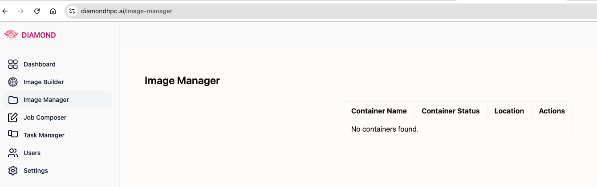

# Quick Start

Use [Diamond](https://diamondhpc.ai/) to launch and manage jobs on High-Performance Computing (HPC) infrastructure.

## Prerequisites
- An account/allocation in the HPC system of your choice. Utilize [ACCESS](https://allocations.access-ci.org/) to get an account.
- Configure a Globus compute endpoint on the HPC. Use the [Globus compute endpoints documentation](https://globus-compute.readthedocs.io/en/2.6.0/endpoints.html) to help you set this up.
- Start the Globus compute endpoint.

## Login to Diamond
- Go to [Diamond](https://diamondhpc.ai/) and sign-in with Globus Auth.
- Choose your identity provider and login.

## Create a apptainer on the HPC system
Utilize the [Image Builder](https://diamondhpc.ai/image-builder) to create an apptainer image on the HPC system.
This functionality lets users create an apptainer definition file (`.def`) on the HPC system, build an apptainer image, and save it to the HPC system.

- On the left hand side menu tab, choose "Image Builder"
- Select the endpoint you want to use to build the image. Eg: `my-globus-compute-endpoint`
- Choose the account/allocation you want to use to build the image. Eg: `bcqj-delta-cpu`
- Choose the right partition for your job. Eg: `cpu`
- Choose a base image. Eg: `python:3.9`
- Copy-paste your requirements in the "Dependencies" section. Eg: `numpy==1.21` . This will get written to a `requirements.txt` file.
- Copy-paste your environment variables in the "Environment" section. Eg: `PYTHONPATH=/path/to/your/python/path`
- Type in your build command in the "Build Command" section. Eg: `pip install -r requirements.txt`
- Review all the settings and click on "Submit"
- Stdout and stderr will be streamed to the web page.

## Image Manager
Utilize the [Image Manager](https://diamondhpc.ai/image-manager) to manage your apptainer images.
This will list all the apptainer images that have been built on the HPC system by the user.

## Launch a job
Utilize the [Job Composer](https://diamondhpc.ai/job-composer) to launch a job on the HPC system.
- Enter the job name.
- Choose a globus compute endpoint to run the job on.
- Choose the HPC account/allocation to run the job on.
- Select a partition, number of nodes and other SLURM parameters for the job.
- Type in a log path to save the job's stdout and stderr.
- Type in a command to run your job.
- Hit "Submit" to launch the job.
- On the left hand side menu tab, choose "Jobs"
- Click on "Launch Job"
- Choose the image you want to use to launch the job.
- Copy-paste your job script in the "Job Script" section.
- Review all the settings and click on "Submit"
- Stdout and stderr will be streamed to the web page.

## Task Manager
Utilize the [Task Manager](https://diamondhpc.ai/task-manager) to manage your jobs.
This will list all the jobs that have been launched on the HPC system by the user.

